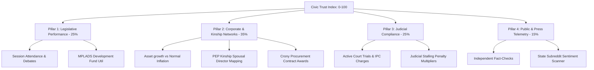

# 🏛️ NETATTRACK v3.0
### Indian Politician Transparency & Accountability Platform

> **NETATTRACK** is an independent, non-partisan, open-source civic technology platform designed to empower Indian voters by consolidating public disclosures, judicial dockets, legislative participation, and corporate interest networks into a single, high-fidelity transparency workspace.

Using a rigorous, data-driven mathematical index called the **Civic Trust Index (CTI)**, NETATTRACK grades public representatives on a 0-100 scale, making structural conflicts of interest, unexplained wealth accumulation, and legislative performance easily visible to the public.

---

## 🗺️ Visual Architectural Flow



---

## 🚀 Key Functional Features

### 1. The Civic Comparison Engine (`/compare`)
- Direct head-to-head overlays of any two representatives.
- Multi-dimensional KPI matrix comparing scores, net worth, criminal charges, attendance, and terms.
- Diverging horizontal compass graphs for sub-scores.
- Interactive Recharts asset growth AreaCharts and legislative attendance BarCharts.
- Shareable URL integration (`?p1=ID&p2=ID`).

### 2. Electoral Geographic Map (`/map`)
- Highly stylized Leaflet dark thematic viewport mapping constituency pins.
- Dynamic color-coding and glowing indicators reflecting score-based risk profiles.
- Regional aggregate dashboards compiling index metrics for major states (Maharashtra, Delhi, Uttar Pradesh, Karnataka, etc.).

### 3. Kinship Corporate Auditor (v3.0 Ingestion Pipeline)
- Evaluates the "Spousal & Kinship Loophole" by mapping the corporate director connections and shareholdings of close relatives (spouses, siblings, children).
- Cross-references state procurement databases against mapped relative companies to flag crony contract wins.
- Applies mathematical penalty multipliers to base indexes for active shell indicators or procurement conflicts.

### 4. Code-Split Optimized Routing
- Employs React lazy loading (`React.lazy()`) and `Suspense` loaders to split heavy pages into standalone bundles, reducing initial payload transfer significantly.

---

## 📊 The Civic Trust Index (CTI) Grading Model

The CTI is computed by compiling four primary data dimensions and scaling down the result via structural risk multipliers:

$$\text{Civic Trust Index} = \text{Base Score} \times M_{crony} \times M_{offshore} \times M_{stalling}$$

### Base Score Allocation (Bscore)
*   **Legislative Performance (25%):** Attendance rate, debates initiated, questions asked, and bills introduced.
*   **Financial Disclosures (30%):** Asset growth vs normal market inflation ($12\%$ CAGR).
*   **Judicial Dossier (25%):** Penal code audits, pending charge sheets, and conviction statuses.
*   **Public Telemetry (15%):** Grievance redress rates (CPGRAMS), fact-checking ratings, and media sentiment.

### Penalty Multipliers (Rm)
- **$M_{crony}$ ($0.70$):** Applied if a close relative's firm won state procurement tenders in the official's jurisdiction.
- **$M_{offshore}$ ($0.75$):** Applied if BVI or Bama holding registry linkages are mapped in offshore leaks databases.
- **$M_{stalling}$ ($0.80$):** Applied if the politician stalls judicial trials through prolonged non-appearance or appeals.

---

## 💻 Tech Stack

| Layer | Technologies Used |
|---|---|
| **Frontend UI** | React 19.2, TypeScript 6.0, Vite 8.0, Tailwind CSS v4 |
| **Data Viz** | Recharts (Area, Bar charts), Leaflet (Map pins & popups) |
| **Search Engine** | Fuse.js (Fuzzy logic search drop-downs) |
| **Backend/DB** | Supabase (@supabase/supabase-js) |
| **Python Ingestion** | BeautifulSoup4, NLTK (VADER Sentiment), OpenCorporates / MCA DIN registers |

---

## 🛠️ Installation & Getting Started

### Prerequisites
- Node.js (v18+)
- Python (v3.10+)

### 1. Frontend Web Setup
Clone the repository and install dependencies:
```bash
git clone https://github.com/DharmadhikariSS/Indian_Politician_Website.git
cd Indian_Politician_Website
npm install
```

Start the Vite hot-reloading development server:
```bash
npm run dev
```

Build the optimized code-split production bundle:
```bash
npm run build
```

### 2. Python Scraper & Grading Engine Setup
Navigate to the scraper directory and install dependencies:
```bash
cd scraper
pip install -r requirements.txt
```

Run the v3.0 CTI scoring validation test:
```bash
PYTHONPATH=. python3 scraper/core/scoring_v3.py
```

---

## ⚖️ Legal Disclaimer & Data Integrity
NETATTRACK is entirely independent, non-partisan, and open-source. All telemetry indices are calculated utilizing mathematical, reproducible algorithms applied uniformly to publicly available government filings (ECI affidavits, e-Courts, legislative ledger entries). An active criminal case represents a judicial allegation and does not equate to a conviction.

---

## 🤝 Contributing
Contributions are highly welcomed! Feel free to:
- Open issues regarding data discrepancies (with official ECI links).
- Write custom state procurement crawlers.
- Localize UI components into regional Indian languages.
